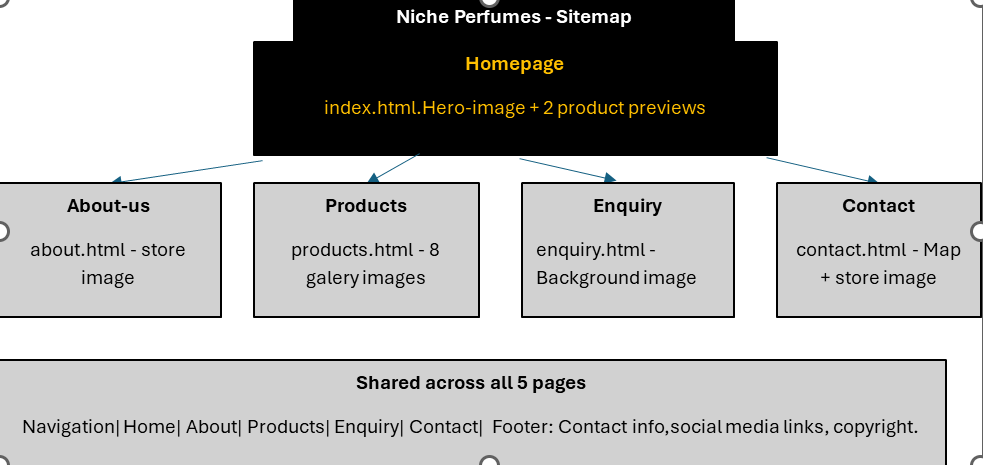
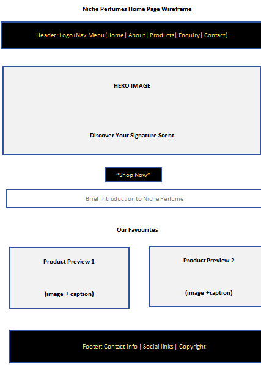

# Niche Perfumes — Website Project

## Project Title
Niche Perfumes Website — Part 1: Building the Foundation

## Student Information
- **Name:** Filloi Marie Antoinette
- **Student Number:** ST10494651
- **Subject:** WEDE5020
- **Qualification:** Diploma in Information Technology Management (DITM)

## Project Overview
Niche Perfumes is a proposed retail business based in Cape Town, South Africa, specialising in
authentic luxury fragrances for men and women. As a start-up with no existing physical store or
online presence, this project builds the business's first digital presence from the ground up —
a five-page website introducing the brand, showcasing its fragrance catalogue, and giving
customers a way to make enquiries.

This repository currently contains **Part 1: Building the Foundation** — project planning, content
research, and the initial HTML structure for all five pages. Part 2 (CSS styling) and Part 3
(JavaScript functionality) will follow in future submissions.

## Website Goals and Objectives
- Increase online visibility and generate direct sales enquiries.
- Showcase the full fragrance catalogue with descriptions and imagery.
- Educate visitors on scent families, ingredients, and the brand's story.

**Key Performance Indicators (KPIs):**
- Monthly unique website visitors.
- Enquiry-to-conversion rate from the enquiry form.
- Average time on site and bounce rate.
- Repeat visitor rate month over month.

## Key Features and Functionality
The website consists of five core pages:

| Page | File | Purpose |
|---|---|---|
| Home | `index.html` | Hero image, brand introduction, call-to-action, featured products |
| About Us | `about.html` | Brand history, mission, vision |
| Products | `products.html` | Fragrance catalogue organised by scent family |
| Enquiry | `enquiry.html` | Contact form for product/stockist enquiries |
| Contact | `contact.html` | Contact details, embedded map, store locations |

Design palette (used consistently across the proposal and the coded pages):
- Primary: Deep Black `#1A1A1A`
- Accent: Champagne Gold `#C9A961`
- Background: Ivory White `#FAF8F3`
- Supporting: Soft Grey `#8A8A8A`

## Timeline and Milestones
| Milestone | Target Week |
|---|---|
| Proposal submitted and organisation approved | Week 1 |
| Content and image research completed | Week 2 |
| File/folder structure and GitHub repository set up | Week 3 |
| HTML structure for all 5 pages completed | Week 4 |
| Part 1 submission (HTML, ZIP, GitHub link) | Week 5 |

## Part 1 Details
Part 1 covers project planning and the foundational HTML structure:
- Website Project Proposal (see `/proposal` or submitted Word document)
- Content Research and Sourcing package (folders, sourcing tracker, original written content)
- File and folder structure (`css/`, `js/`, `images/` with per-page subfolders)
- HTML structure for all five pages, linked via a shared navigation menu
- All images sourced and integrated, matching the colour scheme defined in the proposal

## Part 2 Details
Part 2 covers CSS styling and responsive design:
- External stylesheet (`css/style.css`) linked to all five HTML pages
- Base styles (reset, typography, colour scheme) applied consistently across the site
- Layout structure built with Flexbox (header/nav, hero, product grids, forms)
- Visual styling using the brand palette (Deep Black, Champagne Gold, Ivory White, Soft Grey)
- Interactive states added with `:hover` and `:focus` pseudo-classes (navigation links, buttons, form fields)
- Responsive design implemented with media queries at 768px and 480px breakpoints
- Responsive image (`srcset`/`sizes`) added to the homepage hero image, serving a smaller image on mobile screens
- Tested using browser developer tools across multiple screen sizes: 375px (mobile), 400px (mobile), 768px (tablet), 1024px, and 1440px (desktop)

*Part 3 (JavaScript functionality) will be added in a later submission.*

## Sitemap

Shared across all five pages:
- **Header/Navigation:** Home | About | Products | Enquiry | Contact
- **Footer:** Contact info, social links, copyright

## Wireframe

## Changelog
- **Part 1 — Planning:** Website Project Proposal drafted for Niche Perfumes, including
  organisation overview, goals, KPIs, colour scheme, wireframes, timeline, and budget.
- **Part 1 — Content Research:** Content Research and Sourcing package created, covering
  original page copy and an image sourcing tracker.
- **Part 1 — File Structure:** Project folder structure created (`css/`, `js/`, `images/` with
  `home`, `about`, `products`, `enquiry`, `contact` subfolders).
- **Part 1 — HTML:** Five HTML pages created and linked via shared navigation
  (`index.html`, `about.html`, `products.html`, `enquiry.html`, `contact.html`).
- **Part 1 — Images:** All images sourced from Pexels and integrated into the HTML; file format
  and folder-path issues corrected; images without a valid free licence were removed and
  replaced.
- **Part 1 — Content Fixes:** Contact details updated; colour scheme documented with a swatch
  table matching the coded palette.

  - **Part 2 — CSS Styling:** Created external stylesheet and linked it to all five pages;
  applied base styles, typography, and the brand colour palette across header, hero,
  featured products, about, products, enquiry, and contact sections.
- **Part 2 — Layout:** Implemented Flexbox layouts for navigation, hero section, product
  grids, and the enquiry form.
- **Part 2 — Interactivity:** Added hover and focus states on navigation links, buttons,
  and form fields for better usability.
- **Part 2 — Responsive Design:** Added media queries at 768px and 480px breakpoints to
  adapt the navigation, hero, and image layouts for tablet and mobile screens.
- **Part 2 — Responsive Images:** Added `srcset`/`sizes` to the homepage hero image to
  serve a smaller image on mobile devices.

## References
Bonafide Research (2025) *South Africa Perfume Market Growth & Demand*. Available at:
https://www.bonafideresearch.com/product/6212192417/south-africa-perfume-market (Accessed: 13
August 2026).

Futurism (2026) *South Africa Perfume Market: Fragrance Trends, Premiumization & Growth
Outlook*. Available at:
https://vocal.media/futurism/south-africa-perfume-market-fragrance-trends-premiumization-and-growth-outlook
(Accessed: 13 August 2026).

IMARC Group (2025) *South Africa Perfume Market Size, Share & Forecast 2033*. Available at:
https://www.imarcgroup.com/south-africa-perfume-market (Accessed: 13 August 2026).

### Image References (Harvard Style)
All images used in this project were sourced from Pexels under their free-to-use licence
(https://www.pexels.com/license/).

**Home**

Debonair Afrik Studios (2024) *Stylish man holding a luxurious perfume bottle in a dimly lit
setting*. [Photograph]. Pexels. Available at:
https://www.pexels.com/photo/man-showing-perfumes-14687012/ (Accessed: 13 August 2026).

Abubakar, A. (2025) *Elegant Givenchy perfume bottle on a book, perfect for a luxury lifestyle
theme*. [Photograph]. Pexels. Available at:
https://www.pexels.com/photo/luxury-perfume-bottle-on-an-open-book-30463181/ (Accessed: 13
August 2026).

Mclean, E. (2025) *A stylish black perfume bottle on a textured dark background, showcasing
luxury design*. [Photograph]. Pexels. Available at:
https://www.pexels.com/photo/cosmetic-product-on-black-background-7487827/ (Accessed: 13
August 2026).

**About**

Travelling Tourist (2026) *Bright cosmetics store interior showcasing luxury brands in London*.
[Photograph]. Pexels. Available at:
https://www.pexels.com/photo/modern-perfume-and-cosmetics-store-interior-in-london-36437176/
(Accessed: 13 August 2026).

**Products**

Maram (2024) *Luxurious Elie Saab perfume bottle with a botanical accent on textured fabric*.
[Photograph]. Pexels. Available at:
https://www.pexels.com/photo/perfume-in-glass-bottle-26838653/ (Accessed: 13 August 2026).

Daza, A. (2024) *Luxury perfume bottle and gold jewelry on soft white fabric create an elegant
scene*. [Photograph]. Pexels. Available at:
https://www.pexels.com/photo/luxury-perfume-in-a-glass-bottle-17567999/ (Accessed: 13 August
2026).

Absin (2024) *Elegant still life of a J'adore perfume bottle with packaging in soft lighting*.
[Photograph]. Pexels. Available at:
https://www.pexels.com/photo/bottle-of-perfume-17945897/ (Accessed: 13 August 2026).

Boltneva, V. (2025) *A close-up view of a golden perfume bottle exuding elegance and luxury*.
[Photograph]. Pexels. Available at:
https://www.pexels.com/photo/a-dolce-and-gabbana-perfume-bottle-13800860/ (Accessed: 13 August
2026).

Ahmed, R. (2024) *Dolce & Gabbana perfume bottle placed elegantly with green leaves on a dark
background*. [Photograph]. Pexels. Available at:
https://www.pexels.com/photo/perfume-bottle-beside-green-leaves-13827110/ (Accessed: 13 August
2026).

Lalada (2025) *A close-up of luxury perfume and lipstick showcasing elegance and style*.
[Photograph]. Pexels. Available at:
https://www.pexels.com/photo/glass-perfume-bottle-beside-a-lipstick-8981521/ (Accessed: 13
August 2026).

**Enquiry**

mrish_marina_alekseevna (2024) *Bright and dynamic golden swirl abstract painting, showcasing
motion and energy*. [Photograph]. Pexels. Available at:
https://www.pexels.com/photo/a-yellow-and-white-swirly-abstract-painting-6606011/ (Accessed: 13
August 2026).

**Contact**

Al Assaad, M. (2025) *Indoor scene at New York mall with woman browsing perfumes at a lit kiosk
in warm ambient lighting*. [Photograph]. Pexels. Available at:
https://www.pexels.com/photo/woman-shopping-at-perfume-kiosk-in-mall-34990739/ (Accessed: 13
August 2026).

### Tools Used

I Love IMG (2026) *Resize Image*. Available at: https://www.iloveimg.com/resize-image (Accessed: 27 August 2026).
